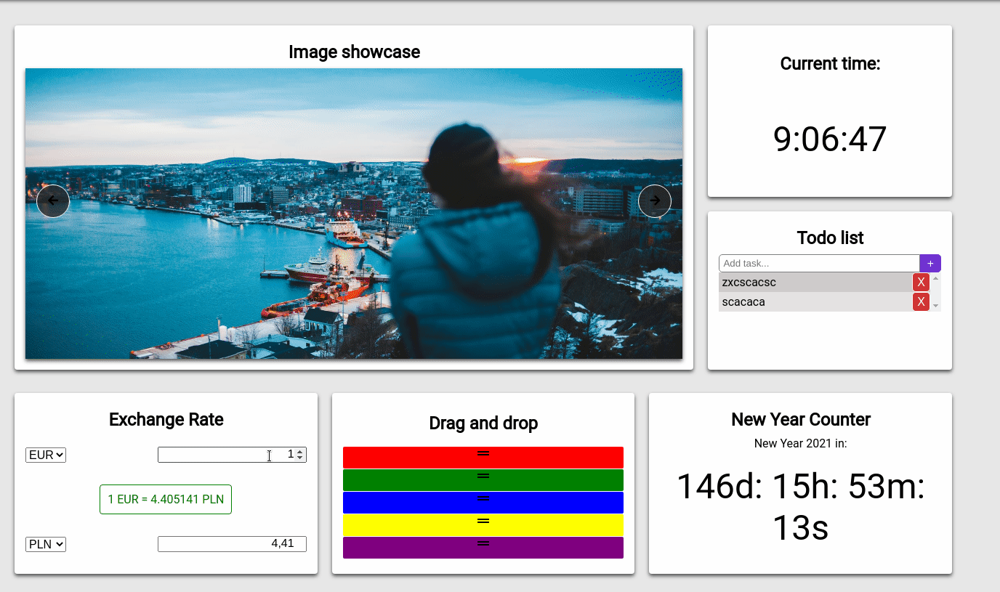

# SHowcase Site

Simple site showcasing some of the JS, CSS and HTML aspects I've learned over time.

There is much of Javascript operations, DOM insertion, Array methods, there is also usage fo Grid system, Flexbox, CSS variables and some uncommon CSS properties.

I've not minified files in order to keep code as it is, so site may run slow.

